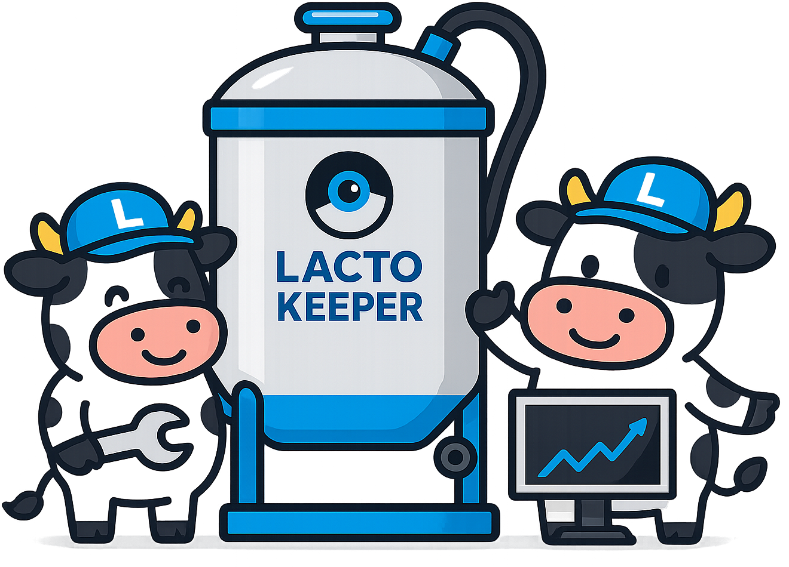

<div align="center">



Open-source web application for dairy farm management, IoT devices and more.

</div>

# Lactokeeper

> [!NOTE]
> **Español**: Para leer este documento en español, visita [readme_es.md](README_ES.md)

This project aims to develop a web application for managing dairy farms, related equipment, milk collection and IoT devices that allow monitoring different aspects of the dairy production process. The application is designed for different user roles, such as administrators, veterinarians and farmers, each with customized permissions and views.

## Project structure

The repository contains two main folders:

- **`src/`**: This folder contains the application source code. It is divided into two folders for frontend and backend.
    - **`frontend/`**: Includes code related to the user interface, using modern web development technologies.
    - **`backend/`**: Code responsible for managing server functionalities, database and API that connects with the frontend.

- **`others/`**: Contains additional resources necessary to understand the project. This includes sketches and prototypes of interfaces and user logic. As well as documentation, diagrams, and any material related to the system structure. It also includes a data populator (`populate-mongodb/`) that allows initializing the MongoDB database with test data.

## How to run the program

Lactokeeper is fully dockerized to facilitate its deployment and execution. The only thing you need to have installed on your system is [Docker](https://www.docker.com/get-started), which will handle all the necessary dependencies and services.

### Getting Started

Start by cloning this repository to your local machine and navigating to the project directory:
```bash
git clone https://github.com/TFG-ATC-TA/tfg-jesusfdez1.git
cd tfg-jesusfdez1
```

If this is your first time running the project or you have made changes to the code, it is recommended to build the Docker images before proceeding:
```bash
docker-compose build
```

With everything ready, you can start all application services with one command. This process will automatically start the database, backend and frontend:
```bash
docker-compose up
```

Once all containers are running correctly, simply open your favorite web browser and visit [http://localhost:3000](http://localhost:3000). There you will find the Lactokeeper interface ready to use.

### Stopping Execution

When you have finished working with the application, you can stop all services easily:
```bash
# Press Ctrl+C in the terminal where it is running, or alternatively:
docker-compose down
```

## Contributing

Want to be part of Lactokeeper's development? Welcome! Feel free to collaborate even if you are not a developer, there are many other important ways you can contribute.

---

## Security

If you believe you have found a security vulnerability, please report it creating a pull request or an issue in the repository. We will investigate all reports.